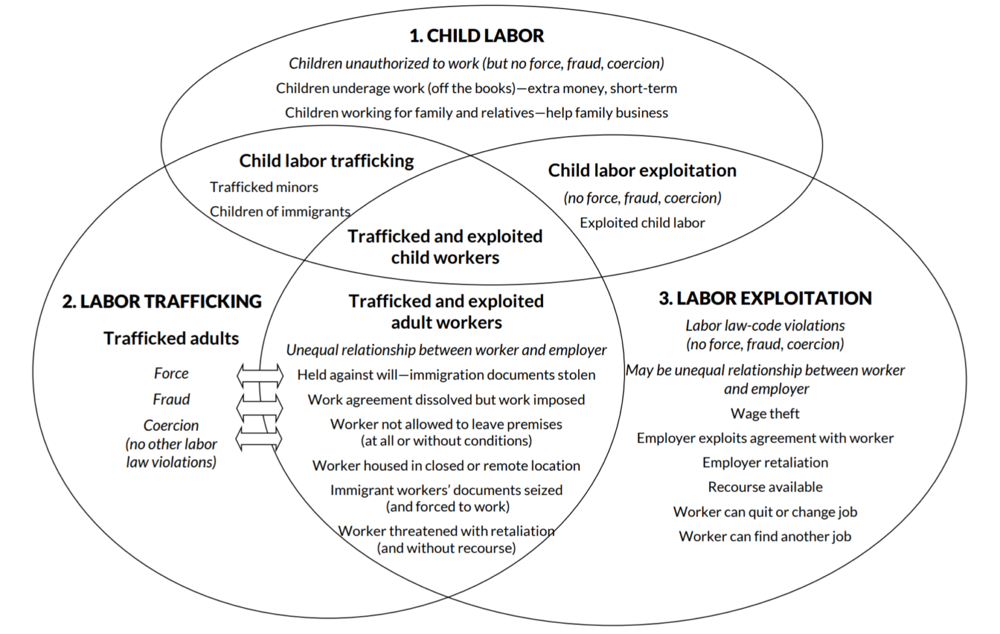

```{r child = "../setup.Rmd"}
```

```{r packages, echo=FALSE, message=FALSE, warning=FALSE}
library(tidyverse)

```

class: middle

# Goal

---

## Goal of statistics

One goal of **statistics** is to answer a **research question**, by making **inferences** about a **population** based on data in one or more **samples**.
- Population: the entire group we would like to make conclusions about (e.g., all people aged 15 and up in China, all pregnancies worldwide)
- Sample: specific group we have collected data from (e.g., a random sample of non-institutionalized people aged 15 and up in sampled households, from sampled villages from sampled counties; pregnancies receiving prenatal care at Duke Hospital)
- The validity of our inferences depends on a variety of factors, including the **representativeness** of our sample

Question: how representative of NC pregnancies would  a sample from Duke Hospital be? 


---

## Drawing Conclusions

In order to draw principled conclusions from our data, we rely on a formal probabilistic framework that allows us to *quantify uncertainty*.


**Statistical inference** is built upon the foundation of **probability theory**.


---

## Probability

The **probability** of an event tells us how likely an event is to occur, and it can take values from 0 to 1, inclusive. It can be viewed as the proportion of times the event would occur if it could be observed an infinite number of times. It can also be viewed as our degree of belief an event will happen.

---

class: middle


# Formalizing Probability

---


## Events

An **event** is the basic element to which probability is applied, e.g. the result of an observation or experiment.

- **A** is the event that a person has blood type A+
- **B** is the event that a person's baby is born preterm
- **C** is the event that a person is a cigarette smoker

---

## Sample Spaces

A **sample space** is the set of all possible outcomes.  So for example, the sample space could be all possible blood types, the event A is the event that your blood type is A+, and the rest of the sample space, $\overline{A}$ as we will see in a minute, contains all other blood types.  

The [prevalence of blood types varies widely around the world](https://en.wikipedia.org/wiki/Blood_type_distribution_by_country). About 36% of the US population has blood type A+, and we can say $P(A)=0.36$ in the US, and then $P(\overline{A})=1-0.36=0.64.

Sample spaces depend on the research question.  For exploration of ABO blood types, the sample space is {A+, A-, B+, B-, AB+, AB-, O+, O-}.

---


## Operations on Events

- The **union** of A and B, denoted $A \cup B$, is the event that A, or B, or both A and B, occur. Here, $A \cup B$ is the event that a person has blood type A+, or had a preterm baby, or both.

- The **intersection** of A and B, denoted $A \cap B$, is the event that both A and B occur. Here $A \cap B$ is the event that a person has blood type A+ and apreterm baby. A and B are **disjoint** or **mutually exclusive** if $A \cap B = \emptyset$ (A and B can't occur simultaneously). That's clearly not the case for these two events. 

- The **complement** of A, denoted $A^c$ or $\overline{A}$, is the event A does not occur (all blood types other than A+). $A$ and $\overline{A}$ are **mutually exclusive**. 

---

## Venn Diagram


```{r echo=FALSE, out.width="75%", fig.align="right", fig.cap="Source: Owens et al., 2014"}

```
---

## Venn Diagram

```{r echo=FALSE, fig.align="left", out.width="45%"}

```
---

class: middle

# How Do Probabilities Work?

---

## Probability Rules

- The probability of any event in the sample space is between 0 and 1, inclusive.

- The probability of the entire sample space is 1.

- If we know the probability of $A$, often denoted $P(A)$, it is easy to calculate the probability of $\overline{A}$ as $P(\overline{A})=1-P(A)$. This is called the **complement rule**:  $P(A)+P(\overline{A})=1$.

---

## Additive Rule of Probability

When events are mutually exclusive (cannot occur together), $P(A\cup B)=P(A)+P(B)$.  When two events can occur simultaneously (think about the overlapping sections in the Venn diagrams), then we need to avoid double-counting when calculating the probability either of two events will occur.

The general **additive rule of probability** is therefore $P(A \cup B)=P(A)+P(B)-P(A \cap B)$ -- because $A \cap B$ is part of the event A and part of the event B, we need to avoid double-counting it.

If two events A and B are mutually exclusive, then $P(A \cap B)=0$.

---

## Computing Probabilities

Intuitively, we can think of the probability of an outcome (or set of outcomes) as the proportion of times the outcome (or set of outcomes) would occur if we observed the random process infinitely many times.

If all the outcomes in our random process (sample space $\mathcal{S}$) are equally likely, then for some event $E$, $$P(E)=\frac{\text{# of outcomes in } E}{\text{# of total outcomes in } \mathcal{S}}.$$

---

class: middle

# Practice

---

### Preterm Birth in the US

Preterm birth, defined as birth before 37 weeks of gestational age,  is a leading cause of morbidity in infancy and childhood and is a direct cause of roughly 1/3 of infant deaths worldwide. Risk of preterm birth varies across race and ethnic groups in the US, and this disparity remains poorly understood.


---

## Preterm Births: US in 2020


| <div style="width:120px;text-align:left">Race/Ethnicity</div> | <div style="width:340px;text-align:center">Preterm Births</div> | <div style="width:340px;text-align:center">Term Births</div> |
|:------|------:|-------:|
| Non-Hispanic White | 191,477 | 1,650,954 |
| Non-Hispanic Black | 92,147 | 437,364 |
| Non-Hispanic American Indian or Alaska Native | 4018 | 22,752 |
| Non-Hispanic Asian | 22,123 | 196,909 |
| Non-Hispanic Native Hawaiian or Pacific Islander | 1631 | 7982 |
| Non-Hispanic Multi Racial | 10,261 | 73,912 |
| Hispanic | 106,318 | 760,047 |
| Not Stated | 4325 | 28949 |

(Maternal race/ethnicity reported on birth certificate)

---


## Practicing with Probabilities

Define events A=preterm birth and B=Non-Hispanic Hawaiian or Pacific Islander. Calculate the following probabilities for a randomly-selected person in this birth cohort.

- $P(A)$

- $P(B)$

- $P(A \cap B)$

- $P(A \cup B)$

- $P(A \cup \overline{B})$

