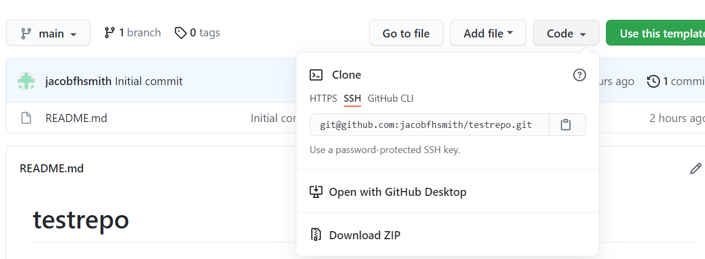

Note: Homework should be done *individually*. While you can discuss general classes of problems with friends (e.g., work through extra practice problems together), working on homework together constitutes a violation of the Duke Community Standard.

# Clone the repo & start new RStudio project (Lab 1 recap!)

-   Go to the [**STA-198-GLHLTH-298-Fall-2022**](https://github.com/STA198F2021) organization on GitHub. Click on the repo with the prefix **hw01**. It contains the starter documents you need to complete the lab.

```{r clone-repo-link, echo = FALSE, fig.width = 5}
```

-   Click on the green **CODE** button, select **Use SSH** (this might already be selected by default, and if it is, you'll see the text **Clone with SSH**). Click on the clipboard icon to copy the repo URL.



-   Go to <https://vm-manage.oit.duke.edu/containers> and login with your Duke NetID and Password.

-   Click **STA198-199** to log into the Docker container.
    You should now see the RStudio environment.

-   Go to *File* $\rightarrow$ *New Project* $\rightarrow$ *Version Control* $\rightarrow$ *Git*.

-   Copy and paste the URL of your assignment repo into the dialog box *Repository URL*. Again, please make sure to have *SSH* highlighted under *Clone* when you copy the address.


-   Click *Create Project*, and the files from your GitHub repo will be displayed in the *Files* pane in RStudio.

-   Open the template R Markdown file.
    This is where you will write up your code and narrative for the lab.
   
   
# Relative Risk of COVID-19

The concept of **relative risk** is useful when we want to compare the probabilities of some outcome event in two different groups. We often think of these two groups as being exposed and unexposed; one group has been subjected to an exposure or risk factor, and the other group has not. The relative risk, abbreviated RR and also known as the risk ratio, is the chance that a member of the exposed group will develop the outcome relative to the chance that a member of the unexposed group will develop the same outcome. The relative risk is defined as the probability of the outcome in the exposed group divided by the probability of the outcome in the unexposed group, or $RR=\frac{Pr(outcome|exposed)}{Pr(outcome|unexposed)}$. It has a nice interpretation -- for example an RR=2 means that exposed individuals are twice as likely to have the outcome as unexposed individuals.

In May 2020, the US contained 4.3% of the world's population and 33% of its confirmed COVID-19 cases.  

1. Using the data provided, what is the probability someone lived in the US in May 2020?  (If it is not possible to determine this completely from the data provided, explain why not. If any derivations are required, show your work. You can either use mathematical notation or include an image as described in this week's lab.)


2. Using the data provided, what is the probability someone had a confirmed case of COVID-19 in May 2020?  (If it is not possible to determine this completely from the data provided, explain why not. If any derivations are required, show your work. You can either use mathematical notation or include an image as described in the week 3 lab.)


3. Using the data provided, what was the conditional probability of living in the US given that someone had a confirmed case of COVID-19 in May 2020?  (If it is not possible to determine this completely from the data provided, explain why not. If any derivations are required, show your work. You can either use mathematical notation or include an image as described in this week's lab.)


4. Using the data provided, what was the conditional probability of having a confirmed case of COVID-19 given that someone lived in the US in May 2020?  (If it is not possible to determine this completely from the data provided, explain why not. If any derivations are required, show your work. You can either use mathematical notation or include an image as described in this week's lab.)


5. What was the relative risk of being a confirmed case of COVID-19 in the US versus the rest of the world in May 2020? (Hint: think of living in the US as being exposed, and living elsewhere as being unexposed. If it is not possible to determine this completely from the data provided, explain why not. If any derivations are required, show your work. You can either use mathematical notation or include an image as described in this week's lab.)  Provide an interpretation of this relative risk.


::: {.commit}
`r emo::ji("yarn")` `r emo::ji("white_check_mark")` `r emo::ji("arrow_up")` Knit and commit your work, using the commit message "Halfway done!" and push.
:::

# Disparities in Birth Outcomes

Disparities in pregnancy outcomes (including preterm birth risk, birth weight, and maternal mortality) across racial and ethnic groups have been well-documented. We will explore these disparities using the 2020 birth records for the United States, available for download from the US Centers for Disease Control and Prevention's National Center for Health Statistics. Here, we have read in the data from those text files and done some basic pre-processing, limiting to a few key variables.

The first thing to note is that the CDC, like many groups, uses 9's to denote missing values. The basic idea is to use enough of them to be unreasonable for the actual outcome -- so looking at some basic descriptive statistics would reveal them. Below, I use the simple max function to show the largest values of gestational age (a typical gestation dated by ultrasound is around 39 weeks, and even elephants, which have the longest gestations among mammals, are not pregnant for 99 weeks!) and birth weight. A typical birth weight is around 3500g, with low birth weight defined as less than 2500g, and a high birth weight defined as more than 4000g. The world record birth weight is actually over 9999g (right at 10.2kg), but 9999 is used here to denote a missing birth weight. After dropping observations with gestage=99 and bwt=9999, I use the max function again to see the largest recorded values in the data. These values are still pretty big -- it is likely that the largest gestational ages may be due to inaccurate dating, but we will look only at whether a pregnancy is preterm or term, so those large gestational age values won't be a big problem, and while an 8kg baby is not common, this is possible.

```{r loaddata, message=FALSE, warning=FALSE}
load("natus2020.RData")

max(natus2020$gestage)
max(natus2020$bwt)


# Note first that gestage uses 99 for missing, and birth weight uses 9999 for missing; we need to fix this!
library(tidyverse)
# For simplicity, limit to babies with known gestational age and birth weight by dropping those who are missing either
birth <- natus2020 %>%
  filter(gestage != 99 & bwt != 9999)


max(birth$gestage)
max(birth$bwt)

```


This semester, we will explore two health disparities with major consequences -- birth outcomes and maternal mortality. Today we explore disparities across race and ethnicity in birth weight and in preterm birth, which are associated with infant morbidity and mortality worldwide. Preterm birth is defined as birth before 37 completed weeks of gestation. [Click here to read more about NIH-funded work on disparities in preterm birth.](https://www.prb.org/resources/high-premature-birth-rates-among-u-s-black-women-may-reflect-the-stress-of-racism-and-health-and-economic-factors/)

To define a variable for preterm birth, we take the gestational age variable (which is measured in integer weeks), and we cut it at 37 weeks, calling births before 37 weeks preterm and births at or after 37 weeks term.  

```{r create-ptb-variable}

# preterm birth defined as birth before 37 completed weeks
# use right=TRUE if you want 37 weeks in the lower interval, and use right=FALSE if you want 37 weeks in the upper interval
# the values 0 and 50 are just values smaller than the smallest value and larger than the largest value of gestage
birth <- birth %>%
  mutate(ptb=cut(gestage,breaks=c(0,37,50),labels=c("preterm","term"), right=FALSE))

birth %>%
  group_by(ptb) %>%
  summarize(n=n())

```


First, we will explore birth weight as a function of race and ethnicity using the `racehisp` variable in the `birth` data. This variable looks at 8 mutually exclusive race and ethnicity categories. Note that the standard definition of race and ethnicity in the birth outcomes literature is based solely on maternal race (paternal race is not always available, and a nontrivial fraction of birth records misclassify paternity). The code below counts births in each group; note that AIAN is the abbreviation for American Indian or Alaska Native, and NHOPI is the abbreviation for Native Hawaiian or other Pacific Islander. You are welcome to look through the data and explore other race classifications if you'd like, but for the homework we will focus on the `racehisp` variable.

```{r race-eth-dist}
birth %>%
  group_by(racehisp) %>%
  summarize(n=n())


```

6. First, how many rows and columns are in the `birth` data, after dropping the births with unknown gestational length or birth weight?

```{r nrow-ncol}
nrow(birth)
#use a similar function ncol to find number of columns
# ncol() 
```

7. The starter code below calculates the average birth weight for each race/ethnicity category along with the minimum, 25th percentile, median, 75th percentile, and maximum of birth weight in each category. Your job is to use a ridge plot to visualize birth weight across the race/ethnicity categories.  Comment on whether the distribution of birth weight varies across these categories, and if so, which categories tend to have higher or lower birth weights.  (Note: a difference in birth weight of 100g is considered a big difference on the population level)

```{r birthweight-stats}
birth %>%
  select(bwt,racehisp) %>%
  group_by(racehisp) %>%
  mutate(qnt_0   = quantile(bwt, probs= 0),
         qnt_25  = quantile(bwt, probs= 0.25),
         qnt_50  = quantile(bwt, probs= 0.5),
         qnt_75  = quantile(bwt, probs= 0.75),
         qnt_100 = quantile(bwt, probs= 1),
              avg = mean(bwt)
          ) %>%
   distinct(qnt_0 ,qnt_25 ,qnt_50 ,qnt_75 ,qnt_100 ,avg)
```


::: {.commit}
`r emo::ji("yarn")` `r emo::ji("white_check_mark")` `r emo::ji("arrow_up")` Now is a good time to knit, commit, and push!
:::


8. The following code chunk breaks down the US births by race/ethnicity, preterm birth status, and combinations of the above (see comments in code).  Your job is to create an informative visualization, based on those discussed in class, to show the disparity in US preterm birth rates across race/ethnicity categories. Be sure to format your plot professionally with nice labels and titles.  Describe these disparities in a paragraph suitable for publication in a short blog post.  

```{r ptb-probs}

# this code gives percentage of race/eth in cohort
birth %>%
  group_by(racehisp) %>%
  summarise(cnt = n()) %>%
  mutate(freq = formattable::percent(cnt / sum(cnt)))

# this code gives percentage of ptb in cohort
birth %>%
  group_by(ptb) %>%
  summarise(cnt = n()) %>%
  mutate(freq = formattable::percent(cnt / sum(cnt)))

# the code below gives the percentage of preterm births in each race/ethnicity group

birth %>%
  group_by(racehisp,ptb) %>%
  summarise(cnt = n()) %>%
  mutate(freq = formattable::percent(cnt / sum(cnt)))


# this code breaks down race/eth of those with and without ptb
birth %>%
  group_by(ptb,racehisp) %>%
  summarise(cnt = n()) %>%
  mutate(freq = formattable::percent(cnt / sum(cnt)))
```


9. Suppose a troll responds to your post by saying "Over twice as many preterm births non-Hispanic white vs. non-Hispanic black!  Preterm birth disparity!"  How is this statement misleading?   Write a well-reasoned response supported by the data.


::: {.commit}
`r emo::ji("yarn")` `r emo::ji("white_check_mark")` `r emo::ji("arrow_up")` Knit and commit remaining changes, use the commit message "Done with hw 1!" and push.
:::

# Submission

Once you are finished with the lab, you will submit the PDF document produced from your final *knit, commit, and push* to Gradescope. Be sure you clean up any "mess" in the output and file before submitting.

Before you wrap up the assignment, make sure all documents are updated on your GitHub repo. We will be checking these to make sure you have been practicing how to commit and push changes.

Remember -- you must turn in a .pdf file to the Gradescope page by the submission deadline to be considered "on time".

To submit your assignment:

-   Go to <http://www.gradescope.com> and click *Log in* in the top right corner.

-   Click *School Credentials* $\rightarrow$ *Duke NetID* and log in using your NetID credentials.

-   Click on your *STA 198* course.

-   Click on the assignment, and you'll be prompted to submit it.

-   Mark the pages associated with each exercise, 1 - 4. All of the papers of your lab should be associated with at least one question (i.e., should be "checked").

-   Select the first page of your .pdf submission to be associated with the *"Workflow"* section.

# Grading (50 pts)

<br>

| Component | Points |
|:----------|:-------|
| Ex 1      | 3      |
| Ex 2      | 3      |
| Ex 3      | 3      |
| Ex 4      | 3      |
| Ex 5      | 6      |
| Ex 6      | 2      |   
| Ex 7      | 8      |
| Ex 8      | 8      |
| Ex 9      | 8      |
| Workflow & formatting   | 6      |

**Grading notes**:

-   The "Workflow & formatting" grade is to assess the reproducible workflow. This includes having at least 3 informative commit messages, labeling the code chunks, updating the name and date in the YAML, and in general having a neat report.

