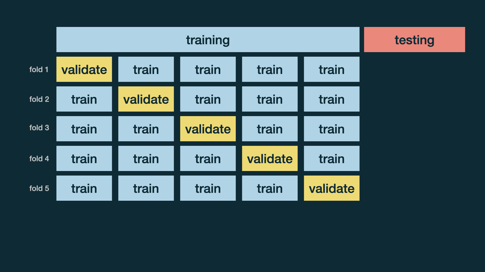

```{r child = "../setup.Rmd"}
```


```{r global_options, include=FALSE}
knitr::opts_chunk$set(
  echo = TRUE,
  message = FALSE,
  warning = FALSE,
  comment = "#>",
  highlight = TRUE,
  fig.align = "center"
)
```

```{r packages, echo = FALSE, message=FALSE, warning=FALSE}
library(tidyverse)
library(tidymodels)
library(gghighlight)
library(knitr)
set.seed(99999)
```

class: middle

# Data and exploration

---

## Continuous Responses

Last time we used a split-sample analysis to develop a model for predicting a binary outcome. Now we consider measures useful in validating a model for a continuous outcome. To do so, we'll reconsider the mercury data.


---


## Mercury data

```{r mercurydata}
mercury <- readr::read_csv("mercury_reg.csv")
mercury <-
  mercury %>%
  # scale() subtracts the mean and divides by the SD to make the units "standard deviations" like a z-score
  mutate(assets_sc=scale(SESassets)) %>%
    #another variable we may use later
  mutate(form_min_sc=scale(FM_buffer)) %>%
  #so I don't have to remember coding
  mutate(sex,sex_cat=ifelse(sex==1,"Male","Female")) %>%
  mutate(native,native_cat=ifelse(native==1,"Native","Non-native")) 

# limit to one observation per household (household ID=1)
mercury1 <-
  mercury %>%
  filter(withinid==1)
mercury1$an_int=mercury1$assets_sc*mercury1$native
mercury1$naturb_int=mercury1$native*mercury1$urban
mercury1$natmine_int=mercury1$native*mercury1$form_min_sc
mercury1$sexage_int=mercury1$sex*mercury1$age
```


---

# Modeling 

---

## Train / test strategy from last time

- Create an initial split

```{r}
mercury_split <- initial_split(mercury1) # prop = 3/4 by default
```

--
.pull-left[
- Save training data
```{r}
mercury_train <- training(mercury_split)
dim(mercury_train)
```
]

--
.pull-right[
- Save testing data
```{r}
mercury_test  <- testing(mercury_split)
dim(mercury_test)
```
]

---
## Specify model

```{r}
mercury_fit <- linear_reg() %>%
  set_engine("lm") %>%
    fit(lhairHg ~ assets_sc * native_cat + form_min_sc + sex_cat + age + urban, data = mercury_train)
  
mp <- tidy(mercury_fit)
print(mp,n=10)
```

---

class: middle

# Evaluate model

---

## Make predictions for training data

```{r}
mercury_train_pred <- predict(mercury_fit, mercury_train) %>%
  bind_cols(mercury_train %>% select(lhairHg))

mercury_train_pred
```

---

## R-squared

Percentage of variability in the hair mercury explained by the model

```{r}
rsq(mercury_train_pred, truth = lhairHg, estimate = .pred)
```

--

.question[
Are models with high or low $R^2$ preferable?
]

---

## RMSE

An alternative model performance statistic: **root mean square error**

$$ RMSE = \sqrt{\frac{\sum_{i = 1}^n (y_i - \hat{y}_i)^2}{n}} $$
Root mean squared error tells us how well the model predicts the response in absolute terms (how close are predicted/fitted values to actual observations), while $R^2$ measures this in percentage terms.

---

```{r rmse-train}
rmse(mercury_train_pred, truth = lhairHg, estimate = .pred)
```

--

.question[
Are models with high or low RMSE are more preferable?
]

---

## Interpreting RMSE

.question[
Is this RMSE considered low or high?
]

```{r ref.label="rmse-train"}
```

```{r}
mercury_train %>%
  summarise(min = min(lhairHg,na.rm=TRUE), max = max(lhairHg,na.rm=TRUE))
```
Here we see the minimum and maximum log hair mercury levels. Root mean squared error is on the same scale as our outcome variable.

---
class: middle

.hand[
.light-blue[
but, really, who cares about predictions on .pink[training] data?
]
]

---

## Make predictions for testing data

```{r}
mercury_test_pred <- predict(mercury_fit, mercury_test) %>%
  bind_cols(mercury_test %>% select(lhairHg))

mercury_test_pred
```

---

## Evaluate performance on testing data

- RMSE of model fit to testing data

```{r}
rmse(mercury_test_pred, truth = lhairHg, estimate = .pred)
```

- $R^2$ of model fit to testing data

```{r}
rsq(mercury_test_pred, truth = lhairHg, estimate = .pred)
```

---

## Training vs. testing

<br>

```{r echo=FALSE}
rmse_train <- rmse(mercury_train_pred, truth = lhairHg, estimate = .pred) %>% 
  pull(.estimate) %>%
  round(3)

rsq_train <- rsq(mercury_train_pred, truth = lhairHg, estimate = .pred) %>% 
  pull(.estimate) %>%
  round(3)

rmse_test <- rmse(mercury_test_pred, truth = lhairHg, estimate = .pred) %>% 
  pull(.estimate) %>%
  round(3)

rsq_test <- rsq(mercury_test_pred, truth = lhairHg, estimate = .pred) %>% 
  pull(.estimate) %>%
  round(3)

tibble(
  data      = c(rep("train", 2), rep("test", 2)),
  estimate  = c(rmse_train, rsq_train, rmse_test, rsq_test),
  metric    = c("RMSE", "R-squared", "RMSE", "R-squared")
) %>%
  pivot_wider(names_from = data, values_from = estimate) %>%
  bind_cols(comparison = c("RMSE lower for training", "R-squared higher for training")) %>%
  kable()
```

---

## Evaluating performance on training data

-  The training set does not have the capacity to be a good arbiter of performance.

--

- It is not an independent piece of information; predicting the training set can only reflect what the model already knows.

--

- Suppose you give a class a test, then give them the answers, then provide the same test. The student scores on the second test do not accurately reflect what they know about the subject; these scores would probably be higher than their results on the first test.

--

- What if your data are relatively small, and you are worried about sample splitting?

.footnote[
.small[
Source: [tidymodels.org](https://www.tidymodels.org/start/resampling/)
]
]

---

class: middle

# Cross validation

---

## Cross validation

Resampling methods like cross-validation can be used to maximize the amount of data used in training a model, while also evaluating its performance. Cross-validation creates a series of data sets like we created before in a single split sample analysis; as in that case, subset of the data are used for creating the model, and a different subset is used to measure performance. However, we do this repeatedly within the same training sample, rather than splitting the training sample into completely separate components for model selection/training and validation.  In both cases, we do retain a completely separate, held-out test data set to evaluate model performance one last time.

---


Consider this schematic (Kuhn & Johnson, 2019).

```{r echo=FALSE, out.width="90%"}

```

---

## Cross validation

More specifically, **k-fold cross validation**:

- Shuffle your data into $k$ partitions
- Use 1 partition for validation, and the remaining $k-1$ partitions for training
- Repeat $k$ times

- Note: our R function calls this **v-fold** cross-validation


---

## Cross validation

```{r echo=FALSE, out.width="100%"}

```

---

## Split data into folds

.pull-left[
```{r}
set.seed(345)

folds <- vfold_cv(mercury_train, v = 5)
folds
```
]
.pull-right[
```{r echo=FALSE, out.width="100%", fig.align="right"}

```
]

---

## Fit resamples

.pull-left[
```{r}
mercury_mod <- linear_reg() %>%
  set_engine("lm")

mercury_rec <- recipe(lhairHg ~ assets_sc + native_cat + form_min_sc + sex_cat + age + urban + an_int, data = mercury_train)

mercury_wflow <- workflow() %>%
  add_model(mercury_mod) %>%
  add_recipe(mercury_rec)

mercury_fit_rs <- mercury_wflow %>%
  fit_resamples(folds)

mercury_fit_rs
```
]
.pull-right[
```{r echo=FALSE, out.width="100%", fig.align="right"}

```
]

---

## Collect CV metrics

```{r}
collect_metrics(mercury_fit_rs)
```

---

## Deeper look into CV metrics

.panelset[
.panel[.panel-name[Raw]
```{r}
collect_metrics(mercury_fit_rs, summarize = FALSE) %>%
  print(n = 10)
```
]
.panel[.panel-name[Tidy]
```{r echo=FALSE}
collect_metrics(mercury_fit_rs, summarize = FALSE) %>%
  select(id, .metric, .estimate) %>%
  pivot_wider(names_from = .metric, values_from = .estimate) %>%
  kable(col.names = c("Fold", "RMSE", "R-squared"), digits = 3)
```
]
]

---

## Compare to simpler model

Let's check how accurate predictions from this model are: RMSE=1.01, $R^2=0.196$, compared to predictions from a simpler model with age, assets, and native community status.

```{r}

mercury_rec_2 <- recipe(lhairHg ~ assets_sc + native_cat + age, data = mercury_train)

mercury_wflow_2 <- workflow() %>%
  add_model(mercury_mod) %>%
  add_recipe(mercury_rec_2)

mercury_fit_rs_2 <- mercury_wflow_2 %>%
  fit_resamples(folds)

collect_metrics(mercury_fit_rs_2)


```
---

## Compare to more complex model

Now let's compare to a model that allows the effects of being in an urban area and living close to a mining operation depend on whether a community is classified as native or non-native, and also that allows the age effect to vary by gender.

```{r}

mercury_rec_3 <- recipe(lhairHg ~ assets_sc + native_cat + form_min_sc + sex_cat + age + urban + an_int + naturb_int + natmine_int + sexage_int, data = mercury_train)

mercury_wflow_3 <- workflow() %>%
  add_model(mercury_mod) %>%
  add_recipe(mercury_rec_3)

mercury_fit_rs_3 <- mercury_wflow_3 %>%
  fit_resamples(folds)

collect_metrics(mercury_fit_rs_3)

```
---

## What's next?

```{r echo=FALSE, out.width="100%", fig.align="right"}
knitr::include_graphics("img/post-cv-testing.png")
```

---

## Picking a Model

When choosing between these three models, we see essentially the same $R^2$ and RMSE, but one model is much simpler than the other two. It makes sense to use the simpler model to facilitate interpretation. 

Our goal was to predict mercury levels in hair. After selecting our best model, our next step is to fit the final model on all the rows of data not originally held out for testing (our full training sample, as opposed to the repeated sub-samples used in the cross-validation scheme) and then evaluate the model performance one last time with the held-out test set.

---

```{r checkfinal}

mercury_fit_preferred <- linear_reg() %>%
  set_engine("lm") %>%
    fit(lhairHg ~ assets_sc + native_cat + age, data = mercury_train)


mercury_test_pred <- predict(mercury_fit_preferred, mercury_test) %>%
  bind_cols(mercury_test %>% select(lhairHg))

rmse(mercury_test_pred, truth = lhairHg, estimate = .pred)

```

---

```{r}

rsq(mercury_test_pred, truth = lhairHg, estimate = .pred)


```

While RMSE didn't change much, we do see a lower $R^2$ in the final test data.

---

Let's practice interpreting results from the model, fit to the full data, now!

```{r finalmodel, out.width="120%", eval=FALSE}
final_fit <- linear_reg() %>%
  set_engine("lm") %>%
    fit(lhairHg ~ assets_sc + native_cat + age, data = mercury1)

final_fit

tidy(final_fit, conf.int=TRUE)
  
```

---


```{r finalmodel2, out.width="120%", echo=FALSE}
final_fit <- linear_reg() %>%
  set_engine("lm") %>%
    fit(lhairHg ~ assets_sc + native_cat + age, data = mercury1)

final_fit

tidy(final_fit, conf.int=TRUE)
  
```
