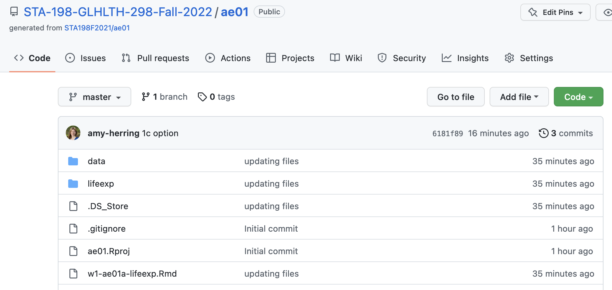
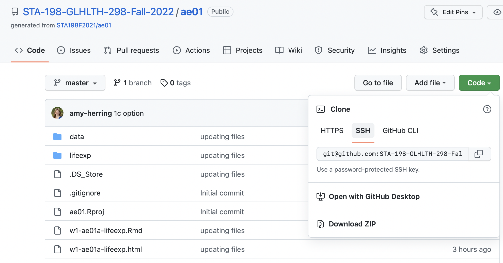
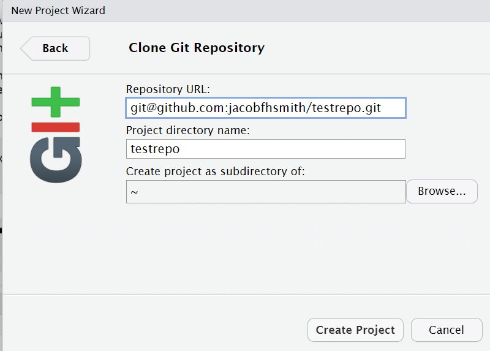

```{r child = "../setup.Rmd"}
```

## AE 01 - First dataviz

You have three options for this exercise:

- Option 1: Life expectancy over time 

- Option 2: COVID-19 fatality numbers across the globe (more complicated plot; if you want to warm up first, start with Option 1!)

- Option 3: Tropical cyclone counts over time

Pick one and complete it. Optionally, try another as well.

---

**Getting Started** 

-   Go to the [**STA-198-GLHLTH-298-Fall-2022**](https://github.com/STA-198-GLHLTH-298-Fall-2022) organization on GitHub. Click on the repo with the prefix **ae01**. It contains the starter documents you need.

```{r clone-repo-link, echo = FALSE, fig.width = 5, warning=FALSE}
library(knitr)

```

---

-   Click on the green **CODE** button, select **HTTPS** (this might already be selected by default). Click on the clipboard icon to copy the repo URL.

```{r clone-repo-link-2, echo = FALSE, warning=FALSE, fig.width = 5}

```

---

-   Go to <https://vm-manage.oit.duke.edu/containers> and login with your Duke NetID and Password.

-   Click **STA198-199** to log into the Docker container.
    You should now see the RStudio environment.

-   Go to *File* $\rightarrow$ *New Project* $\rightarrow$ *Version Control* $\rightarrow$ *Git*.

---

-   Copy and paste the URL of your assignment repo into the dialog box *Repository URL*. You may need to select the R directory (or create another as the file location).

```{r clone-repo-link-3, echo = FALSE, warning=FALSE, fig.width = 4}

```


---

-   Click *Create Project*, and the files from your GitHub repo will be displayed in the *Files* pane in RStudio.


---


.your-turn[
**Option 1.**

- In the Files pane (bottom right corner), spot the file called `w1-ae01a-lifeexp.Rmd`. 

- Open it and click "Knit".

- Then...
  - Go back to the file and change your name on top (in the `yaml` -- we'll talk about what this means later) and knit again.
  
  - Change the country names to those you're interested in. Spelling and capitalization must match how the countries appear in the data, so take a peek at the Appendix to confirm spelling.
  
  - Knit again. Voila, your first data visualization!
]

---

.your-turn[
**Option 2.**

- In the Files pane (bottom right corner), spot the file called `w1-ae01b-covid.Rmd`.

- Open it. You may get a message in the top of the upper left hand pane that the package *coronavirus* has not been installed -- click there to install it first. Then click "Knit".

- Then...
  - Go back to the file and change your name on top (in the `yaml` -- we'll talk about what this means later) and knit again.
  
  - Change the country names to those you're interested in. Spelling and capitalization must match how the countries appear in the data, so take a peek at the Appendix to confirm spelling.
  
  - Knit again. Voila, your first data visualization!
]

---

.your-turn[
**Option 3.**

- In the Files pane (bottom right corner), spot the file called `w1-ae01c-climate.Rmd`. 

- Open it and click "Knit".

- Then...
  - Go back to the file and change your name on top (in the `yaml` -- we'll talk about what this means later) and knit again.
  
  - Change the years to those you're interested in. 
  
  - Knit again. Voila, your first data visualization!
]


