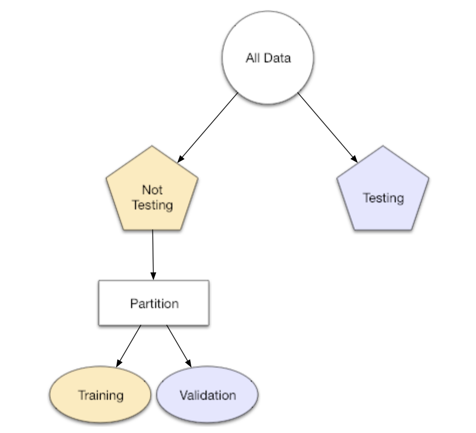

```{r child = "../setup.Rmd"}
```


```{r global_options, include=FALSE}
knitr::opts_chunk$set(
  echo = TRUE,
  message = FALSE,
  warning = FALSE,
  comment = "#>",
  highlight = TRUE,
  fig.align = "center"
)
```

```{r packages, echo = FALSE, message=FALSE, warning=FALSE}
library(tidyverse)
library(tidymodels)
library(openintro)
library(patchwork)
library(skimr)
set.seed(1213)
options(
  warnPartialMatchArgs = FALSE,
  warnPartialMatchAttr = FALSE, 
  warnPartialMatchDollar = FALSE,
  width = 100
)
```


class: middle

# Prediction

---

## GATS Data

```{r readdata, warning=FALSE, message=FALSE}
gats <- readr::read_csv("data/gats_rev.csv")

gats <- gats %>%
  filter(CURRENTSMOKE == "1") %>%
  filter(TRYSTOP != "9") %>%
  select(-CIGS_DAY,-CASEID,-CURRENTSMOKE,-AGESTART,-REGION6,-REGION3,-HEARDOFECIG,-ECIGUSE) %>%
  filter(EDUCATION < 9) %>%
  filter(OCCUPATION < 10) %>%
  filter(HOMESMOKERULES < 5) %>%
  filter(SMOKESICK < 3) %>%
  filter(SMOKECANCER < 3)

gats$RESIDENCE=factor(gats$RESIDENCE,levels=c(1,2),labels=c("Urban","Rural"))
gats$PROVINCE=factor(gats$PROVINCE,levels=seq(1:31),labels=c("Beijing","Tianjin","Hebei","Shanxi","Neimenggu","Liaoning","Jilin","Heilongjiang","Shanghai","Jiangsu","Zhejiang","Anhui","Fujian","Jiangxi","Shangdong","Henan","Hubei","Hunan","Guangdong","Guangxi","Hainan","Chongqing","Sichuan","Guizhou","Yunnan","Xizang","Shaanxi","Gansu","Qinghai","Ningxia","Xinjiang"))
gats$GENDER=factor(gats$GENDER,levels=c(1,2),labels=c("Male","Female"))
gats$EDUCATION=factor(gats$EDUCATION,levels=c(1,2,3,4,5,6,7,8,77,99),labels=c("None","Less than Primary School","Primary School","Less than Secondary School","Secondary School","High School","University","Postgraduate","Don't Know","Refused"))
gats$OCCUPATION=factor(gats$OCCUPATION,levels=c(1,2,3,4,5,6,7,8,9,10,77,99),labels=c("Farming","Government","Business","Teacher","Healthcare","Student","Soldier","Unemployed","Retired","Other","Don't Know","Refused"))
gats$TRYSTOP=factor(gats$TRYSTOP,levels=c(1,2),labels=c("Yes","No"))
gats$TRYSTOP=relevel(gats$TRYSTOP, ref = "No")
gats$TRYSTOP=as.factor(gats$TRYSTOP)
gats$HOMESMOKERULES=factor(gats$HOMESMOKERULES,levels=c(1,2,3,4,7,9),labels=c("Allowed","Not Allowed but Exceptions","Never Allowed","No Rules","Don't Know","Refused"))
gats$SMOKESICK=factor(gats$SMOKESICK,levels=c(1,2,7,9),labels=c("Yes","No","Don't Know","Refused"))
gats$SMOKECANCER=factor(gats$SMOKECANCER,levels=c(1,2,7,9),labels=c("Yes","No","Don't Know","Refused"))
gats$AGE2=gats$AGE*gats$AGE
```

---

## Goal: Predict Who Has Tried to Stop Smoking

- Data: Set of survey responses, and we know who tried to stop smoking, and who hasn't

- Use logistic regression to predict the probability that someone has tried to stop smoking

- Consider how we might compare different models in terms of predictive performance

--
- Building a model to predict the probability that someone will try to stop smoking is only half of the battle! We also need a decision rule about whom we predict to have tried to stop (e.g. what probability should we use as out cutoff?)

--

- A simple approach: choose a single threshold probability and any person who exceeds that probability is flagged as someone who may have tried to stop

---

## A multiple logistic regression approach

Let's start by including a lot of predictors in a big model.
```{r stop-mlr, results = "hide"}
bigmod <- logistic_reg() %>%
  set_engine("glm") %>%
  fit(TRYSTOP ~ GENDER+PROVINCE+RESIDENCE+EDUCATION+
        OCCUPATION+HOMESMOKERULES+
        SMOKESICK+SMOKECANCER+GENDER*EDUCATION + GENDER*OCCUPATION + AGE + AGE2 + AGE*GENDER + AGE2*GENDER, data = gats, family = "binomial") %>%
  tidy() 
```
 
---

```{r res1}
print(bigmod,n=17)
```

---

```{r res2}
print(bigmod[18:33,],n=16)
```

---

```{r res3}
print(bigmod[34:52,],n=19)
```


---

```{r res4}
print(bigmod[53:72,],n=21)
```


---

## Some observations

- Our model has a lot of predictors

- Some information is likely repetitive

- Some information is likely noise

- How do we pick a "best" model to get the "best" predictions?

---

## Prediction

- The mechanics of prediction are **easy**:

  - Plug in values of predictors to the model equation
  
  - Calculate the predicted value of the response variable, $\hat{y}$

--

- Getting it right is **hard**!

  - There is no guarantee the model estimates you have are correct
  
  - Or that your model will perform as well with new data as it did with your sample data

---

## Underfitting and overfitting

```{r echo=FALSE, out.width="70%", warning = FALSE}
lm_fit <- linear_reg() %>%
  set_engine("lm") %>%
  fit(y4 ~ x2, data = association)

loess_fit <- loess(y4 ~ x2, data = association)

loess_overfit <- loess(y4 ~ x2, span = 0.05, data = association)

association %>%
  select(x2, y4) %>%
  mutate(
    Underfit = augment(lm_fit$fit) %>% select(.fitted) %>% pull(),
    OK       = augment(loess_fit) %>% select(.fitted) %>% pull(),
    Overfit  = augment(loess_overfit) %>% select(.fitted) %>% pull(),
  ) %>%
  pivot_longer(
    cols      = Underfit:Overfit,
    names_to  = "fit",
    values_to = "y_hat"
  ) %>%
  mutate(fit = fct_relevel(fit, "Underfit", "OK", "Overfit")) %>%
  ggplot(aes(x = x2)) +
  geom_point(aes(y = y4), color = "darkgray") +
  geom_line(aes(y = y_hat, group = fit, color = fit), size = 1) +
  labs(x = NULL, y = NULL, color = NULL) +
  scale_color_viridis_d(option = "plasma", end = 0.7)
```

---

## Spending our data

- Several steps to create a useful model: parameter estimation, model selection, performance assessment, etc.

- Doing all of this on the entire data we have available can lead to **overfitting**

- Allocate specific subsets of data for different tasks, as opposed to allocating the largest possible amount to the model parameter estimation only (which is what we've done so far)

---

class: middle

# Splitting data

---

## Splitting data

- **Not-Testing set:**
  - Sandbox for model building 
  - Spend most of your time using the not-testing set to develop the model
  - Often split the not-testing set into training and validation components
  - Majority of the data (often 80%)
  
- **Testing set:**
  - Held in reserve to determine efficacy of one or two chosen models
  - Critical to look at it once, otherwise it becomes part of the modeling process
  - Remainder of the data (often 20%)
  
---

Consider the following schematic from the Tidymodels website.

```{r, echo=FALSE, out.width="45%"}

```

---

## Performing the split

```{r}
# Fix random numbers by setting the seed 
# Enables analysis to be reproducible when random numbers are used 
set.seed(1213)

# Put 80% of the data into the training set 
gats_split <- initial_split(gats, prop = 0.80)

# Create data frames for the two sets:
nottest_data <- training(gats_split)
test_data  <- testing(gats_split)

# Split the non-testing data into training and validation components
nottest_split <- initial_split(nottest_data,prop=0.80)
nottest_train_data <- training(nottest_split)
nottest_validation_data <- testing(nottest_split)
```

---

## Peek at the split

.small[
.pull-left[
```{r}
glimpse(nottest_train_data)
```
]
.pull-right[
```{r}
glimpse(test_data)
```
]
]

---

## Fit our model to the training dataset

```{r}
trystop_m1 <- logistic_reg() %>%
  set_engine("glm") %>%
  fit(TRYSTOP ~ GENDER+PROVINCE+RESIDENCE+EDUCATION+
        OCCUPATION+HOMESMOKERULES+
        SMOKESICK+SMOKECANCER+GENDER*EDUCATION + GENDER*OCCUPATION + AGE + AGE2 + AGE*GENDER + AGE2*GENDER , data = nottest_train_data, family = "binomial") 

```

.small[
```{r}
trystop_m1
```
]

---

## Predict outcome on the validation dataset

```{r}
predict(trystop_m1, nottest_validation_data)
```


---

## Predict probabilities on the validation dataset

```{r}
trystop_pred1 <- predict(trystop_m1, nottest_validation_data, type = "prob") %>%
  bind_cols(nottest_validation_data %>% select(TRYSTOP))

trystop_pred1
```

---

## A closer look at predictions

.pull-left-wide[
```{r highlight.output=c(17, 18)}
trystop_pred1 %>%
  arrange(desc(.pred_Yes)) %>%
  print(n = 15)
```
]


---

## Evaluate the performance

**Receiver operating characteristic (ROC) curve**<sup>+</sup> plots true positive rate vs. false positive rate (1 - specificity)

.pull-left[
```{r roc, fig.show="hide"}
trystop_pred1 %>%
  roc_curve(
    truth = TRYSTOP,
    .pred_Yes,
    event_level = "second"
  ) %>%
  autoplot()
```
]
.pull-right[
```{r ref.label="roc", echo=FALSE, out.width="100%"}
```
]

.footnote[
.small[
<sup>+</sup>Originally developed for operators of military radar receivers, hence the name.
]
]

---


## Evaluate the performance

Find the area under the curve:

.pull-left[
```{r}
trystop_pred1 %>%
  roc_auc(
    truth = TRYSTOP,
    .pred_Yes,
    event_level = "second"
  )
```
]
.pull-right[
```{r ref.label="roc", echo=FALSE, out.width="100%"}
```
]

OK, this is not a lot better than randomly predicting based on the prevalence of having tried to stop smoking in the data (AUC=0.5).

---

## Comparing Models

Let's compare the fit of this large model to one that does not contain any of the interaction terms.

```{r smallermodel, message=FALSE, warning=FALSE}
trystop_m2 <- logistic_reg() %>%
  set_engine("glm") %>%
  fit(TRYSTOP ~ GENDER+PROVINCE+RESIDENCE+EDUCATION+
        OCCUPATION+HOMESMOKERULES+
        SMOKESICK+SMOKECANCER + AGE + AGE2, data = nottest_train_data, family = "binomial") 

trystop_pred2 <- 
  predict(trystop_m2, nottest_validation_data, type = "prob") %>% 
  bind_cols(nottest_validation_data %>% select(TRYSTOP))

```

---

.pull-left[
"Big" model with gender, education, occupation, residence,  province, home rules, beliefs, age, interactions
```{r ref.label="roc", echo=FALSE, out.width="100%"}
```

```{r, echo=FALSE}
trystop_pred1 %>%
  roc_auc(
    truth = TRYSTOP,
    .pred_Yes,
    event_level = "second"
  )
```
]
.pull-right[
Model without gender, education, occupation, and residence
```{r roc2, fig.show="hide", echo=FALSE}
trystop_pred2 %>%
  roc_curve(
    truth = TRYSTOP,
    .pred_Yes,
    event_level = "second"
  ) %>%
  autoplot()
```

```{r ref.label="roc2", echo=FALSE, out.width="100%"}
```

```{r, echo=FALSE}
trystop_pred2 %>%
  roc_auc(
    truth = TRYSTOP,
    .pred_Yes,
    event_level = "second"
  )
```
]

---

Here you see "bigger" isn't "better" -- we have a higher AUC and better predictive accuracy in our smaller model. 

Our bigger model may have been overfitting/"chasing the data" too much.

---

The model with only an intercept should yield an AUC of 0.5 (chance assignment).

```{r intonlymodel, message=FALSE, warning=FALSE}
trystop_m3 <- logistic_reg() %>%
  set_engine("glm") %>%
  fit(TRYSTOP ~ 1, data = nottest_train_data, family = "binomial") 

trystop_pred3 <- predict(trystop_m3, nottest_validation_data, type = "prob") %>% bind_cols(nottest_validation_data %>% select(TRYSTOP))

trystop_pred3 %>%
  roc_auc(
    truth = TRYSTOP,
    .pred_Yes,
    event_level = "second"
  )
```
---
```{r}


trystop_pred3 %>%
  roc_curve(
    truth = TRYSTOP,
    .pred_Yes,
    event_level = "second"
  ) %>%
  autoplot()


```

---

At the end of the day, we are predicting who has tried to stop smoking better than by random chance, but this is not a highly accurate algorithm. It is possible that with additional variables, for example about motivation or other psychological factors, we could do a better job with our prediction.

---

## Checking Preferred Model

To finish, we fit our preferred model on the test data to assess its fit in the completely untouched test sample.

```{r finalcheck}
trystop_mf <- logistic_reg() %>%
  set_engine("glm") %>%
  fit(TRYSTOP ~ PROVINCE+HOMESMOKERULES+SMOKESICK+
        SMOKECANCER, data = nottest_data, family = "binomial") 

trystop_predf <- 
  predict(trystop_mf, test_data, type = "prob") %>% 
  bind_cols(test_data %>% select(TRYSTOP))
```

---

```{r finalroc}
trystop_predf %>%
  roc_curve(
    truth = TRYSTOP,
    .pred_Yes,
    event_level = "second"
  ) %>%
  autoplot()

```

---

```{r rocvalue}

trystop_predf %>%
  roc_auc(
    truth = TRYSTOP,
    .pred_Yes,
    event_level = "second"
  )

```

Our performance is similar in the completely untouched sample.  